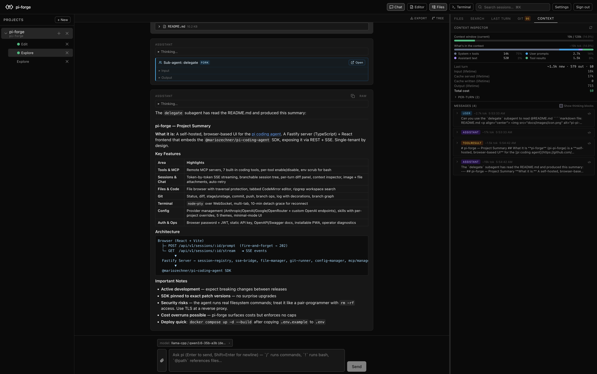
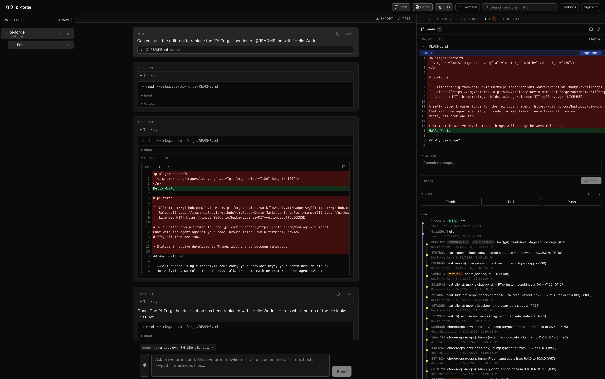
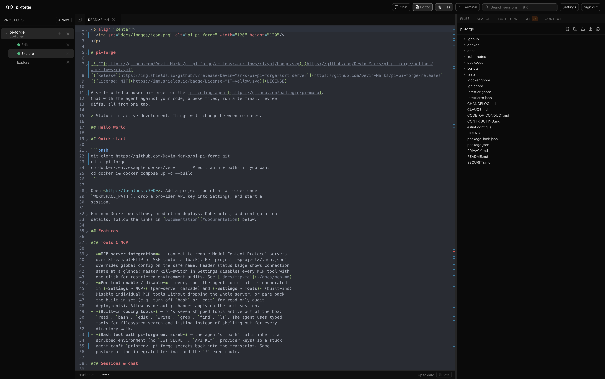
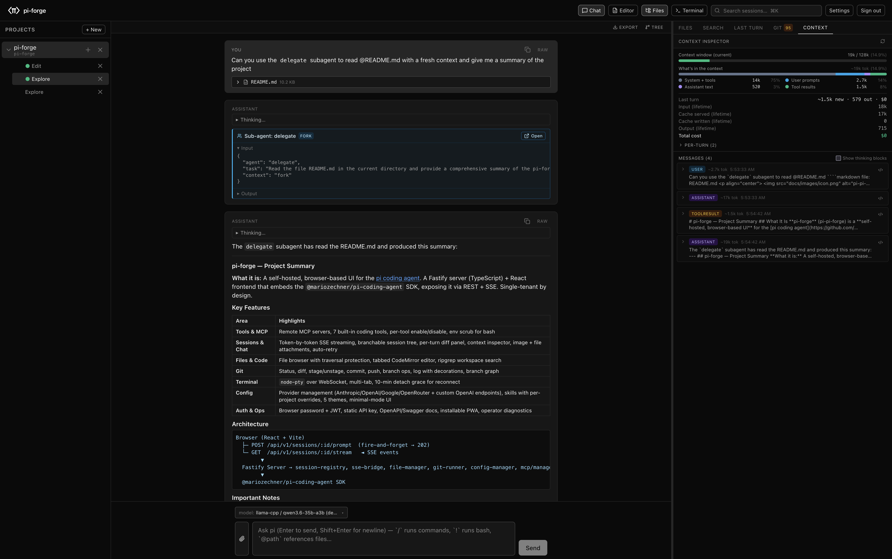
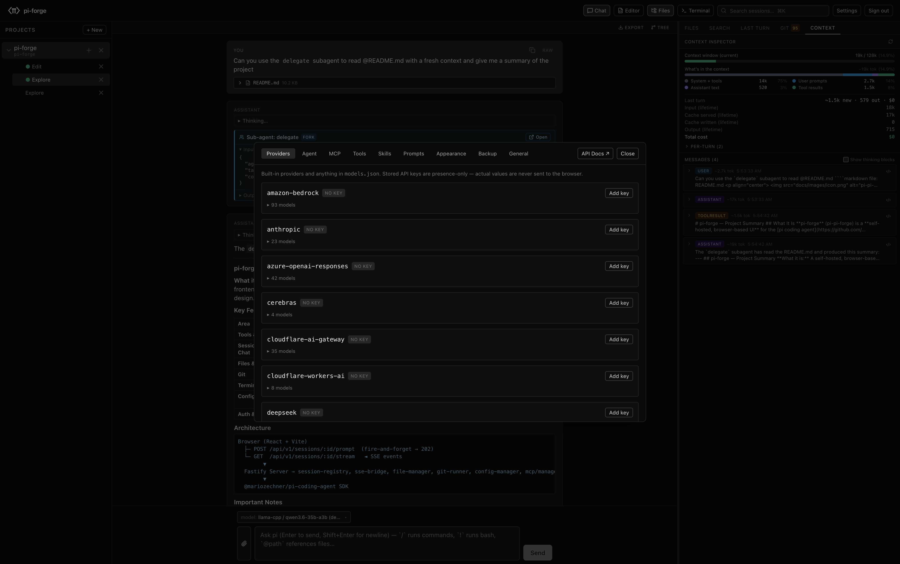
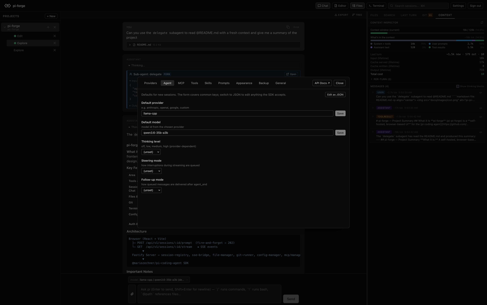
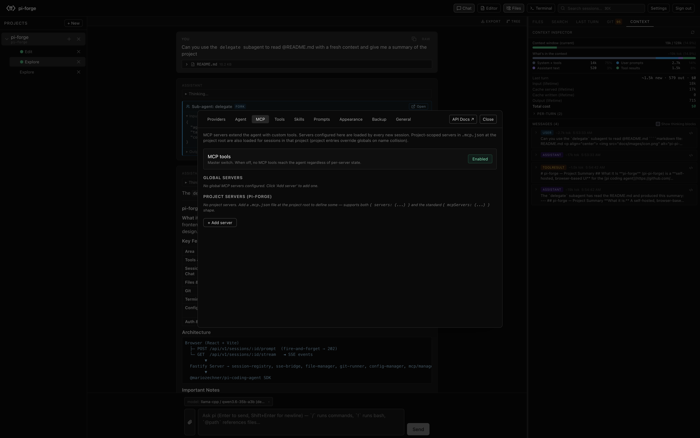

<p align="center">
  
</p>

# pi-forge

[](https://github.com/Devin-Marks/pi-forge/actions/workflows/ci.yml)
[](https://github.com/Devin-Marks/pi-forge/releases)
[](LICENSE)

A self-hosted browser UI for the [pi coding agent](https://github.com/badlogic/pi-mono).
Chat with the agent against your code, browse files, run a terminal, and review
diffs — all from one tab.

<p align="center">
  
</p>

<details>
<summary>More screenshots</summary>

<p align="center">
  
  <br/><br/>
  
  <br/><br/>
  
  <br/><br/>
  
  <br/><br/>
  
  <br/><br/>
  
</p>

</details>

## Why pi-forge?

- **Self-hosted, single-tenant.** Your code, your provider keys, your container.
  No cloud, no analytics, no multi-tenant cross-talk.
- **Container-native.** Ships as a Docker image; deploys to Docker Compose,
  Kubernetes, or OpenShift with the manifests in this repo. Bind-mount your
  project tree, set an API key, go.
- **Same API the UI uses.** Every browser interaction is a REST or SSE call
  documented at `/api/docs`. Scripts, CI pipelines, and the chat UI hit the
  same endpoints — no shadow surface.

## Quick start

### Docker (recommended for ongoing use)

```bash
git clone https://github.com/Devin-Marks/pi-forge.git
cd pi-forge
cp docker/.env.example docker/.env       # edit auth + paths if you want
cd docker && docker compose up -d --build
```

### npm (no Docker, runs from your shell)

```bash
npx pi-forge                  # one-shot
npm install -g pi-forge       # or install globally, then `pi-forge`
```

By default pi-forge listens on `http://localhost:3000`, reads provider config
from `~/.pi/agent/` (shared with the host `pi` CLI if you have one), and
stores its own state in `~/.pi-forge/`. Override with flags or env vars —
every server env var has a matching `--flag`:

```bash
pi-forge --port 4000 --workspace-path ~/Code
pi-forge --api-key @/run/secrets/api-key --no-expose-docs
pi-forge --help            # full flag table grouped by category
```

Flags win when both a flag and the matching env var are set. See
[`docs/configuration.md`](./docs/configuration.md) for the full mapping.

Open the listed URL, add a project (a folder under your workspace path),
drop a provider API key into Settings, and start a session.

For source builds and a development setup see
[`CONTRIBUTING.md`](./CONTRIBUTING.md); for everything else follow the
[Documentation](#documentation) table below.

## Features

- **Streaming chat** — token-by-token rendering with inline tool calls and results.
- **Branchable session tree** — fork at any prior turn, navigate the tree,
  bookmark abandoned branches, summarize-on-navigate.
- **Per-turn diff panel** — every file the agent touched in the last turn,
  aggregated into one reviewable changeset.
- **Workspace tools in one tab** — file browser, tabbed CodeMirror editor with
  ripgrep search, integrated `node-pty` terminal (persists across page refresh),
  and a full git panel (status, diff, stage, commit, push, branch, log).
- **MCP integration** — connect remote servers over StreamableHTTP / SSE,
  per-project `.mcp.json`, per-tool toggles, master kill-switch in Settings.
- **Pi-subagents support** — built-in surfacing of the community
  [pi-subagents](https://github.com/nicobailon/pi-subagents) plugin (install
  separately): rich tool card for parent calls, child sessions in the project
  sidebar with cascade-delete on parent removal.
- **Provider management** — Anthropic / OpenAI / Google / OpenRouter built-in,
  plus custom OpenAI-compatible endpoints (vLLM, LiteLLM, Ollama, internal
  gateways) via `models.json`.
- **Per-project overrides** — tri-state toggles (enable / disable / inherit)
  for skills, tools, and prompts; cascade view shows every project's override
  at a glance.
- **Auth that fits ops** — browser password + JWT (auto-generated signing key,
  persisted across restarts) and / or a static API key for scripts and CI.
  Loopback bind by default.
- **Programmatic API** — REST + SSE with auto-generated OpenAPI 3 spec at
  `/api/docs/json` and an interactive Swagger UI at `/api/docs`.
- **Installable PWA** — manifest with raster + maskable icons, offline page,
  mobile-tuned chat surface, "Add to Home Screen" on desktop and mobile.

The full feature grid (with categories and screenshots) is on the
[project site](https://devin-marks.github.io/pi-forge/#features).

## Documentation

**Install & deploy**
- [Docker image](./docs/containers.md) — image internals, volumes, env, troubleshooting
- [Private-network deployment](./docs/deployment.md) — reverse proxy, auth, multi-deploy patterns
- [Kubernetes / OpenShift](./kubernetes/DEPLOY.md) — manifests + walkthroughs
- [Security model](./SECURITY.md) — threat model + vulnerability reporting

**Configure & extend**
- [Configuration & env vars](./docs/configuration.md) — every flag, env var, and pi config file
- [MCP servers](./docs/mcp.md) — connect remote MCP servers, per-tool toggles
- [Mobile / PWA install](./docs/mobile.md) — "Add to Home Screen" on iOS / Android

**Use programmatically**
- [API examples](./docs/api-examples.md) — curl / Python / Node walkthroughs against `/api/v1`
- [SSE event catalogue](./docs/sse-events.md) — every event type with example payload

**Project**
- [Architecture & data flow](./docs/architecture.md) — component map, request lifecycles
- [Contributing](./CONTRIBUTING.md) — dev setup, PR process, release flow
- [`CLAUDE.md`](./CLAUDE.md) — agent-facing conventions and gotchas
- [Privacy](./PRIVACY.md) · [Code of Conduct](./CODE_OF_CONDUCT.md)

## Versions

Each pi-forge release pins exact patch versions of the pi SDK trio
(`pi-coding-agent`, `pi-agent-core`, `pi-ai`) — no caret/tilde — so a
transparent SDK upgrade can't surprise an existing install. Pinned versions
live in [`packages/server/package.json`](./packages/server/package.json).

Only the latest tag is supported. Breaking SDK changes pi-forge had to absorb
appear in the release notes' **Changed** section. Per-tag notes:
[CHANGELOG.md](./CHANGELOG.md).

## Heads up

pi-forge drives a coding agent that runs real commands (`bash`, `write`,
`edit`) as the container user. Review what it does, set provider-side spending
limits, and run it on a private network — pi-forge is not designed for
public-internet exposure. See [`SECURITY.md`](./SECURITY.md) for the threat
model and [`docs/deployment.md`](./docs/deployment.md) for deploy guidance.

## License

MIT — see [`LICENSE`](./LICENSE). Built on
[pi-mono](https://github.com/badlogic/pi-mono), the upstream pi agent SDK.
